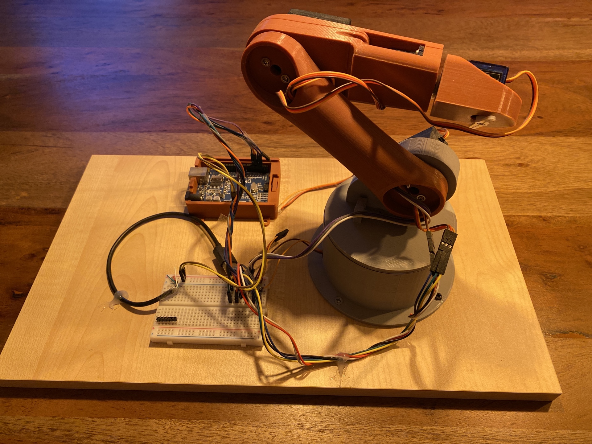
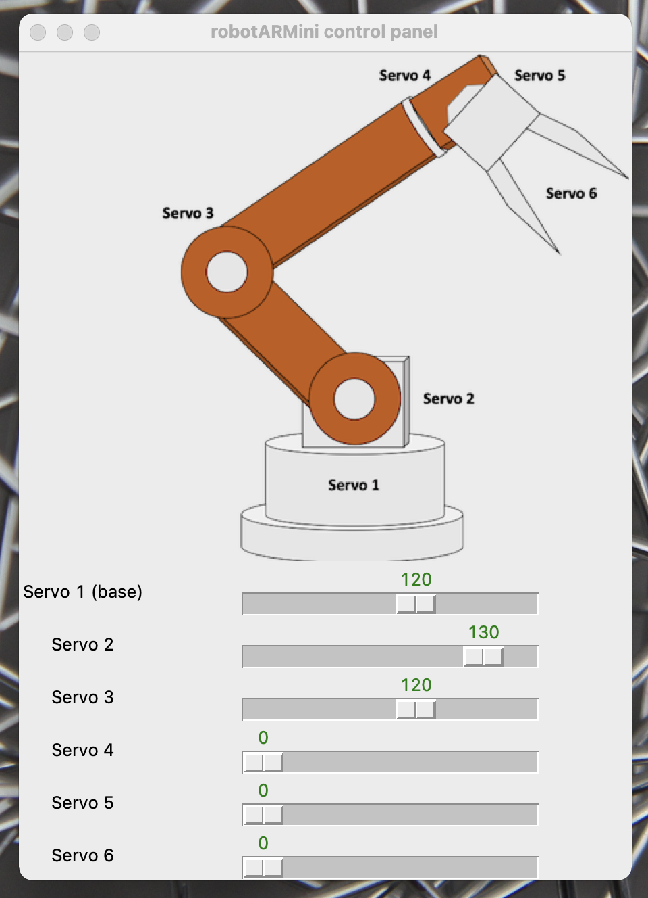

# robotARMini
Python skript to control an arduino based robot arm via a python Interface.

## Setup:
<figure role="group">
  
  <figcaption>
    Fig 1. Setup of the RobotARMini based on the 3D model designed by Dejan [1].
  </figcaption>
</figure>

The Software Interface is done with Tkinter via a User Interface with sliders.

## GUI:
Designed with Tkinter slides:

<figure role="group">
  
  <figcaption>
    Fig 2. GUI to control the robotARMini via serial communication (Arduino UNO).
  </figcaption>
</figure>

## Install:
1. Use the Arduino IDE to load the StandardFirmata[2] Software on your Arduino Board to get an easy access on the Arduino via python. (You will find it in the StandardFirmata folder)
2. Open the <b>robotARMini_control.py</b> python code and set up the port your are using for the serial connection to the arduino as well as servo-range constraints (<b>servo_range</b>). min = minimum angle, max = maximum angle, init = initial angle).
3. Run the code and control your robot arm via the GUI.

### Issues:
In this code only the servos 1-3 are used. For the following servos extend the code analogous to servo 1-3. 

## References:
[1] https://howtomechatronics.com/tutorials/arduino/diy-arduino-robot-arm-with-smartphone-control/, accessed 28.08.2021

[2] StandardFirmata: https://www.arduino.cc/reference/en/libraries/firmata/, accessed 31.10.2021

[3] Tkinter: https://docs.python.org/3/library/tkinter.html, accessed 31.10.2021
